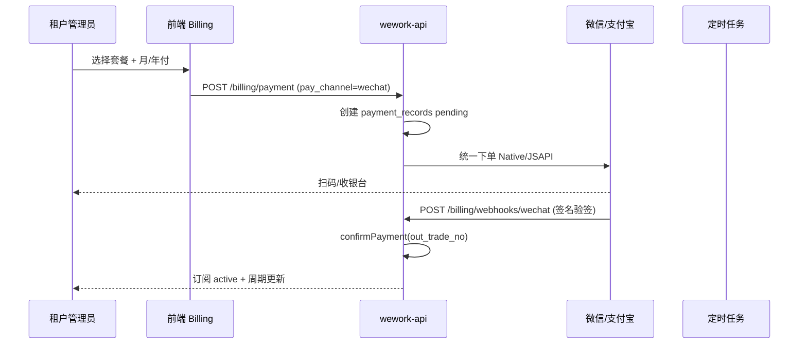

# ZhiFlow 在线支付对接方案（调研稿）

> 状态：**Phase 1 微信 Native + Phase 2 支付宝当面付 + Phase 3 微信 JSAPI（公众号内）** 已落地。  
> 生产需配置商户号并执行 `database/065_payment_wechat_columns.sql`。  
> 未配置时仍可用「线下转账 + 兑换码」。本地可设 `WECHAT_PAY_MOCK=1` / `ALIPAY_MOCK=1` 联调。  
> 数据表 `payment_records.pay_channel` 已预留 `wechat` / `alipay` / `manual`。

## 1. 目标流程



与现有逻辑对齐点：

- `billing.service.createPaymentRecord` 已生成 `out_trade_no`
- `billing.service.confirmPayment` 已负责 `paid` + `createSubscription`
- 平台后台 `POST /platform/payments/confirm` 可保留作 **人工兜底**

## 2. 接入方式对比

| 方案 | 优点 | 缺点 | 建议 |
|------|------|------|------|
| **官方微信 + 支付宝直连** | 费率低、资金直达 | 需企业主体、两个商户号、证书与合规 | 长期主路径 |
| **聚合支付（Ping++、BeeCloud 等）** | 一套 API 多通道 | 额外费率、依赖第三方 | 快速验证 MVP |
| **虎皮椒等个人/小微通道** | 上线快 | 合规与稳定性风险 | 仅内测，不建议生产 |

**推荐路径：**

1. **Phase 1（2–3 周）**：微信支付 **Native 扫码**（PC 计费页）+ 异步通知验签 → 自动 `confirmPayment`
2. **Phase 2**：支付宝 **当面付 precreate 扫码**（已实现，`ALIPAY_MOCK` 可联调）
3. **Phase 3**：企业微信内 **JSAPI**（侧栏 H5 打开计费页时）

## 3. 后端改动清单

### 3.1 环境变量（`backend/.env.example` 待补）

```env
# 微信支付 v3
WECHAT_PAY_MCH_ID=
WECHAT_PAY_APP_ID=
WECHAT_PAY_API_V3_KEY=
WECHAT_PAY_SERIAL_NO=
WECHAT_PAY_PRIVATE_KEY_PATH=

# 支付宝
ALIPAY_APP_ID=
ALIPAY_PRIVATE_KEY=
ALIPAY_PUBLIC_KEY=

# 回调公网地址（须 HTTPS）
BILLING_NOTIFY_BASE_URL=https://wework.syzs.top
```

### 3.2 新路由（建议）

| 方法 | 路径 | 说明 |
|------|------|------|
| `POST` | `/api/v1/billing/payment` | 扩展：当 `pay_channel=wechat` 时返回 `{ out_trade_no, code_url }` |
| `POST` | `/api/v1/billing/webhooks/wechat` | 微信通知，**无 JWT**，仅验签 |
| `POST` | `/api/v1/billing/webhooks/alipay` | 支付宝通知 |
| `GET` | `/api/v1/billing/payments/:out_trade_no/status` | 前端轮询 pending → paid |

### 3.3 幂等与安全

- 以 `out_trade_no` 为幂等键；重复通知若已 `paid` 直接返回 success
- 通知 IP 白名单（微信/支付宝官方段）+ 签名验签
- 金额必须与 `payment_records.amount` 一致，防篡改
- 日志脱敏，不写完整证书

### 3.4 数据库（可选迁移）

```sql
ALTER TABLE payment_records
  ADD COLUMN prepay_id VARCHAR(64) NULL COMMENT '微信 prepay_id' AFTER out_trade_no,
  ADD COLUMN notify_raw JSON NULL COMMENT '最后一次回调摘要' AFTER remark;
```

## 4. 前端改动清单

- `BillingPage` 提交订单后：
  - `manual`：保持现状（提示转账）
  - `wechat`：展示二维码 +「支付完成」轮询或 WebSocket（轮询即可）
- 套餐卡片增加「微信支付」「支付宝」按钮（需 `settings:manage`）
- 支付成功 Toast + 刷新 `/billing/subscription`

## 5. 合规与主体

- 微信支付：需 **企业营业执照** 开通 JSAPI/Native
- 支付宝：企业 **电脑网站支付** 或 **当面付**
- 类目建议选择 **软件/信息技术服务**；商品名「ZhiFlow 专业版订阅」等
- 发票：B2B 可继续线下开票，与在线支付并行

## 6. 工作量粗估

| 项 | 人天 |
|----|------|
| 微信 Native + 回调 + 联调 | 3–5 |
| 支付宝 | 2–3 |
| 前端收银台 UI | 1–2 |
| 测试与对账脚本 | 1–2 |
| **合计** | **约 7–12 人天** |

## 7. 已实现接口（代码对照）

| 方法 | 路径 | 说明 |
|------|------|------|
| `GET` | `/api/v1/billing/payment/channels` | 返回 `wechat` / `alipay` 的 `enabled` / `mock` |
| `POST` | `/api/v1/billing/payment` | `pay_channel=wechat` 或 `alipay` 时返回 `code_url` |
| `GET` | `/api/v1/billing/payment/:outTradeNo/status` | 租户轮询订单（需登录） |
| `POST` | `/api/v1/billing/webhooks/wechat` | 微信异步通知（无 JWT） |
| `POST` | `/api/v1/billing/webhooks/wechat/mock` | 仅 `WECHAT_PAY_MOCK=1` |
| `POST` | `/api/v1/billing/webhooks/alipay` | 支付宝异步通知（无 JWT，响应 `success`） |
| `POST` | `/api/v1/billing/webhooks/alipay/mock` | 仅 `ALIPAY_MOCK=1` |

实现文件：`wechatPay.service.js`、`alipay.service.js`、`frontend/src/components/OnlinePayCheckoutDialog.tsx`。

## 8. 上线检查

- [ ] 生产 `ENABLE_SUBSCRIPTION_EXPIRY_CRON=1`（试用到期企微通知）
- [ ] 沙箱/1 分钱订单走通 pending → paid → 订阅 active
- [ ] 平台后台仍能手动确认异常单
- [ ] 兑换码路径回归不受影响

## 8. 参考

- [微信支付 API v3 文档](https://pay.weixin.qq.com/wiki/doc/apiv3/index.shtml)
- [支付宝开放平台](https://opendocs.alipay.com/)
